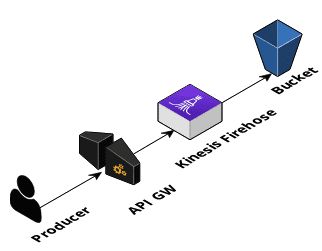

## Unauthenticated Firehose Example

This example provides a working Firehose endpoint with IAM authentication offloaded to API Gateway. The following resources are created:

* Firehose
* S3 bucket
* API Gateway
* Permission roles needed

No configuration is required to launch the CloudFormation template `firehose.yml`. Once it's up and going look to the `ServiceEndpoint` to point your producer at.
### Producer

RUN `deploy.sh` after you have added the `AWS credentials` to your terminal environment, and this should kick off a CloudFormation stack that you will use later when you run the bash script `producer.sh,` and that should fill up the S3 bucket with data from the movie cvs file.

Within this repo includes sample data and a shell script that will submit all of the records to the API Gateway address. Ensure that your AWS credentials are configured. Update the `STACK_NAME` and `REGION` values to match where you've launch the `firehose.yml` cloudformation template within `producer.sh`. Then run the shell script to send over the contents of `data/moviedata2.csv` to the firehose.

This will take a while as it sequentially posts each record one by one.

### Validation

Find the S3 bucket that was created by the CloudFormation template. After a minute or 100mb of data sent through the firehose your data will show up. Download a sample to see that it is indeed the data that you expect to have within the bucket.

Have that S3 bucket name handy, you'll need it for our next step.

### Crawl a DB schema

Within the AWS web console add a new AWS Glue crawler. Choose your S3 bucket to be crawled, all of it. The wizard will guide you to create an IAM role for the necessary permission. This job will be run on demand only. We will be creating a new database, we'll call it `movies`.

Once you've completed the crawler wizard choose to `Run crawler`

Let it complete its job before moving onto the next.

### Athena init

If you've not used Athena within your AWS account before you'll need to [set a destination for results](https://docs.aws.amazon.com/athena/latest/ug/querying.html) first.

Create a S3 bucket that will be used for this purpose, all defaults can be accepts. This is where the output of your query results will reside.

Within the Athena web console click on the `set up a query result location in Amazon S3` link (if it doesn't show then you've already completed this process, you do not need to do it again.)

### Athena query

Glue's schema should be visible within AWS Athena web console look in the drop down of `Database`'s you should see your newly created `movies` DB. Below is one `Table` that was created by Glue associated with the DB. On the right there are 3 stacked dots, click to find `Preview table`. This will show the first 10 movie records!

### Athena filtering

Note your table database and table name make up the source and where the SQL `FROM` is targeting within the query. Yours will be unique to your account.

Activities within Athena Movie Dataset

* How many movies begin with “The”
* What is the average rating of all of the movies
* What movie has the lowest rating score
* Which movie has the longest plot description?
* Which year has the most movies?

MySQL Commands used. These

* SELECT * FROM "movies"."firehose_thing_databucket_yrryghds7frk" where col2=(select min(col2) from "movies"."firehose_thing_databucket_yrryghds7frk")
* SELECT * FROM "movies"."firehose_thing_databucket_3vsxwrn106rv" where col1 like 'The%'
* SELECT * FROM "movies"."firehose_thing_databucket_1fgwlefnay9n1" ORDER BY LENGTH(col3) DESC LIMIT 1;
* SELECT * FROM "movies"."firehose_thing_databucket_yrryghds7frk" where length(col3)=(select max(length(col3)) from "movies"."firehose_thing_databucket_yrryghds7frk")
* SELECT col0, COUNT(col0) AS "value_occurrence" FROM "movies"."firehose_thing_databucket_usg8zb7hamxj" GROUP BY col0 ORDER BY "value_occurrence" DESC LIMIT 1;
